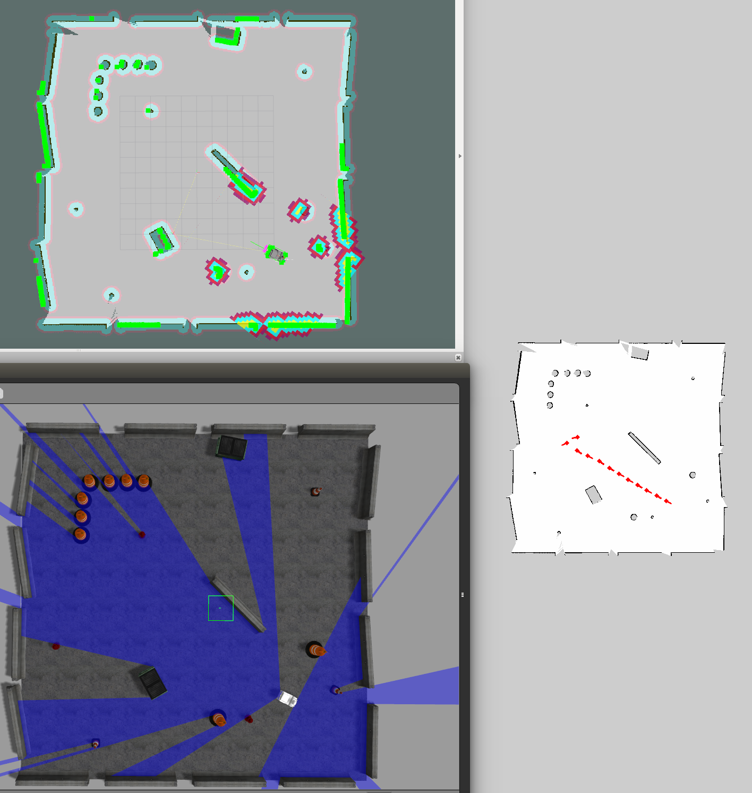

# remote_monitor  [](https://travis-ci.org/CIR-KIT/remote_monitor) [](https://cir-kit.slack.com/messages/remote_monitor)
Remote monitoring package for navigation

## Demo Video
[](https://youtu.be/hpAnaV-bylQ)

下記のコマンドで上記動画のように遊べるはずです

```bash
$ roslaunch cirkit_unit03_navigation_gazebo autorun.launch 
$ roslaunch remote_monitor remote_monitor_server.launch gazebo:=true map_yaml:=playpen_map.yaml
$ roslaunch remote_monitor remote_monitor_client.launch 
```

## Nodes
### monitor_server
 - 遠隔監視PC側`node`．`service`で受信した位置と姿勢を地図上に表示させる

### monitor_client
 - 移動ロボット側`node`．一定距離毎に現在位置と姿勢を`service`で送信する．
 - デフォルトでは`/amcl_pose`を`subscribe`する．

## Installation
以下のコマンドにしたがってインストールしてください．  
なお`<catkin_ws>`は，任意のcatkinizeされたワークスペースへのパスを表します．

```bash
$ cd <catkin_ws>/src
$ git clone https://github.com/CIR-KIT/remote_monitor.git
$ cd <catkin_ws>
$ wstool init src
$ wstool merge -t src src/remote_monitor/remote_monitor.rosinstall
$ wstool update -t src
$ rosdep update && rosdep install -r -y --from-paths src --ignore-src
$ catkin_make
$ source devel/setup.bash
```

## How to launch
### service server
- 地図の在処として，下記のパッケージ配下のフォルダを見に行きます．
  - $(find cirkit_unit03_maps)/map/`
- 地図名は引数で指定して下さい．

- 実機の場合のコマンド

```bash
$ roslaunch remote_monitor remote_monitor_server.launch map_yaml:=hogehoge.yaml
```

- `Gazebo`の場合のコマンド
```
$ roslaunch remote_monitor remote_monitor_server_gazebo.launch map_yaml:=hogehoge.yaml
```

### service client
#### 1. サーバー側のグローバルIPを設定する．

- まずサーバ側の人にグローバルIPを聞く

- 以下の容量で設定ファイルに反映させる．
```
$ cd /etc/openvpn
$ emacs client.conf
```

```
# 省略

# グローバルIPアドレスを指定する．
remote 101.102.103.xxx 1194

# 省略
```

#### 2. OpenVPNを再起動する.

```bash
$ service openvpn restart
```

#### 3. ネットワークを確認する．

```bash
$ ifconfig
```

- 下記のような`tun`デバイスが表示される．少し時間がかかる場合がある．

```bash
tun0      Link encap:不明なネット  ハードウェアアドレス 00-00-00-00-00-00-00-00-00-00-00-00-00-00-00-00  
          inetアドレス:10.8.0.6  P-t-P:10.8.0.5  マスク:255.255.255.255
          UP POINTOPOINT RUNNING NOARP MULTICAST  MTU:1500  メトリック:1
          RXパケット:0 エラー:0 損失:0 オーバラン:0 フレーム:0
          TXパケット:12 エラー:0 損失:0 オーバラン:0 キャリア:0
          衝突(Collisions):0 TXキュー長:100 
          RXバイト:2892 (2.8 KB)  TXバイト:504 (504.0 KB)
```

- そしてサーバにping

```bash 
$ ping 10.8.0.1
```

#### 4. ROSネットワークの設定

- 必ず***全てのコンソール***で下記の設定をすること．

```bash
export ROS_MASTER_URI=http://10.8.0.6:11311
export ROS_HOST_NAME=10.8.0.6
export ROS_IP=10.8.0.6
```

- 下記をsourceでもよい．

```bash
roscd remote_monitor/scripts
source vpn_setting_for_robot.sh
```

- 一応確認する．

```bash
$ env | grep ROS
```

#### 5. ROSネットワークの確認

```bash
$ rosservice list
```

- 下記のサービスがあることを確認する．

```bash
/remote_monitor_robot_pose
/remote_monitor_human_pose
```

#### 6. モニタークライアントを起動する

- 実機設定
```bash
$ roslaunch remote_monitor remote_monitor_client.launch
```

- Gazebo設定
```bash
$ roslaunch remote_monitor remote_monitor_client_gazebo.launch
```

## parameters
- `/config/remote_monitor_server.yaml`
  - ratio: 0.2
    - 元画像ファイルを表示する際の初期縮小率。

- `/config/third_robot_client.yaml`
  - interval_dist: 1.0
    - 現在地を送る周期(距離[m]毎)
  - pose_topic: `amcl_pose`
    - `subscribe`するトピック名
    
## command
- 地図画像をアクティブにした状態で下記キーを入力するとモードを切り替えられます。
- `c`: current
  - 現在のロボットの位置のみを地図上に表示します。
- `h`: history
  - 履歴を含んだロボットの位置を地図上に表示します。
- `r`: reset history
  - history モードの履歴をクリアします。
- `p`: plus to ratio
  - 地図を拡大します。historyモードの履歴は削除します。
- `m`: minus to ratio
  - 地図を縮小します。historyモードの履歴は削除します。
