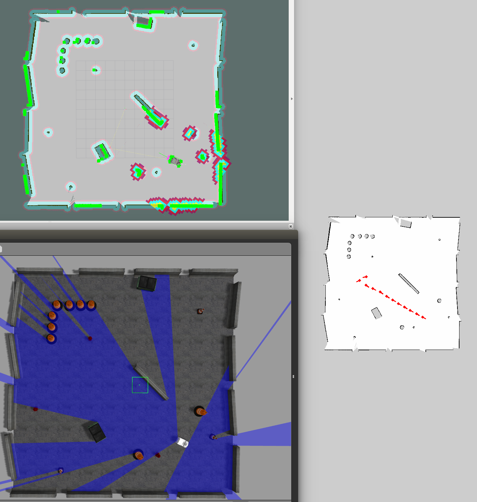

# third_robot_monitor
遠隔監視用のパッケージです．

## Demo Video
[](https://youtu.be/hpAnaV-bylQ)

下記のコマンドで上記動画のように遊べるはずです

```bash
$ roslaunch third_robot_2dnav_gazebo autorun.launch 
$ roslaunch third_robot_monitor third_robot_monitor_server.launch gazebo:=true map_yaml:=playpen_map.yaml
$ roslaunch third_robot_monitor third_robot_monitor_client.launch 
```

## Nodes
### monitor_server
 - 遠隔監視PC側`node`．`service`で受信した位置と姿勢を地図上に表示させる

### monitor_client
 - 移動ロボット側`node`．一定距離毎に現在位置と姿勢を`service`で送信する．
 - デフォルトでは`/amcl_pose`を`subscribe`する．
 
## How to launch
### service server
- 地図の在処として，下記のパッケージ配下のフォルダを見に行きます．
  - 実機: `$(find third_robot_2dnav)/map/`
  - Gazebo: `$(find third_robot_2dnav_gazebo)/map/`
- 地図名は引数で指定して下さい．

- 実機の場合のコマンド

```bash
$ roslaunch third_robot_monitor third_robot_monitor_server.launch map_yaml:=hogehoge.yaml
```

- `Gazebo`の場合のコマンド
```
roslaunch third_robot_monitor third_robot_monitor_server.launch map_yaml:=hogehoge.yaml gazebo:=true
```

### service client
```
roslaunch third_robot_monitor third_robot_monitor_client.launch
```

## parameters
- `/config/third_robot_monitor_server.yaml`
  - ratio: 0.2
    - 元画像ファイルを表示する際の初期縮小率。

- `/config/third_robot_client.yaml`
  - interval_dist: 1.0
    - 現在地を送る周期(距離[m]毎)
  - pose_topic: `amcl_pose`
    - `subscribe`するトピック名
    
## command
- 地図画像をアクティブにした状態で下記キーを入力するとモードを切り替えられます。
- `c`: current
  - 現在のロボットの位置のみを地図上に表示します。
- `h`: history
  - 履歴を含んだロボットの位置を地図上に表示します。
- `r`: reset history
  - history モードの履歴をクリアします。
- `p`: plus to ratio
  - 地図を拡大します。historyモードの履歴は削除します。
- `m`: minus to ratio
  - 地図を縮小します。historyモードの履歴は削除します。
